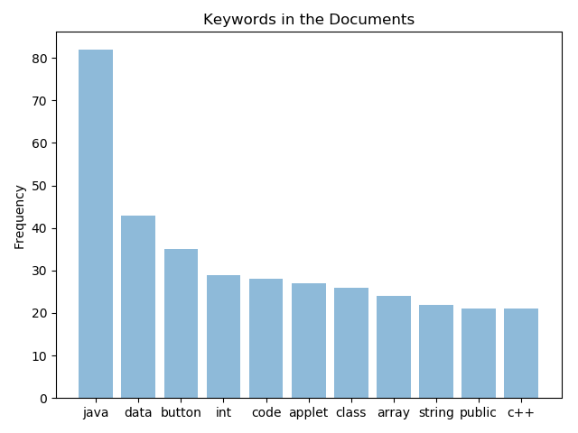

# Exam_Preparation_Online
### Keywords based on TF(Term Frequency)

## Overview
The script extracts all text from the given **PDF**. The text is then filtered for _Stopwords_, _Punctuations_ and _Header_
etc after being **Tokenized.** Term Frequency of the **Top 11** Keywords is calculated and plotted in a bar graph. A table 
is also given as output containing **Top 40** Keywords.

