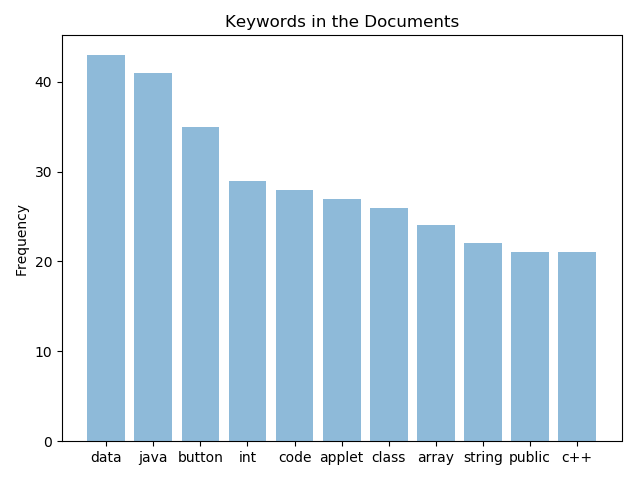

# Keyword (Bag of Words)

## Overview
The script(main.py) extracts all text From the given **PDF** using PyPDF2. The text is then filtered for _Stopwords_, _Punctuations_ and _Header_
etc after being **Tokenized** with the help of nltk, strings and numpy. Term Frequency of the **Top 11** Keywords is calculated and plotted in a bar graph via matplotlib. A table 
is also given as output containing **Top 10** Keywords(tabulate).

### Top 40 Words

|**Keyword**  | **Frequency**
|------------ | -----------
|data         |         43
|java*        |         41
|button       |         35
|int          |         29
|code         |         28 
|applet       |         27
|class        |         26
|array        |         24
|string       |         22
|public       |         21

##### * The word "java" is present in the header and footer of every page (21 pages), it has 42 extra instances. Hence, there are only 41 true instances(83 - 42).  

## Dependencies

- PyPDF2
- nltk
- matplotlib
- numpy
- tabulate
- string

